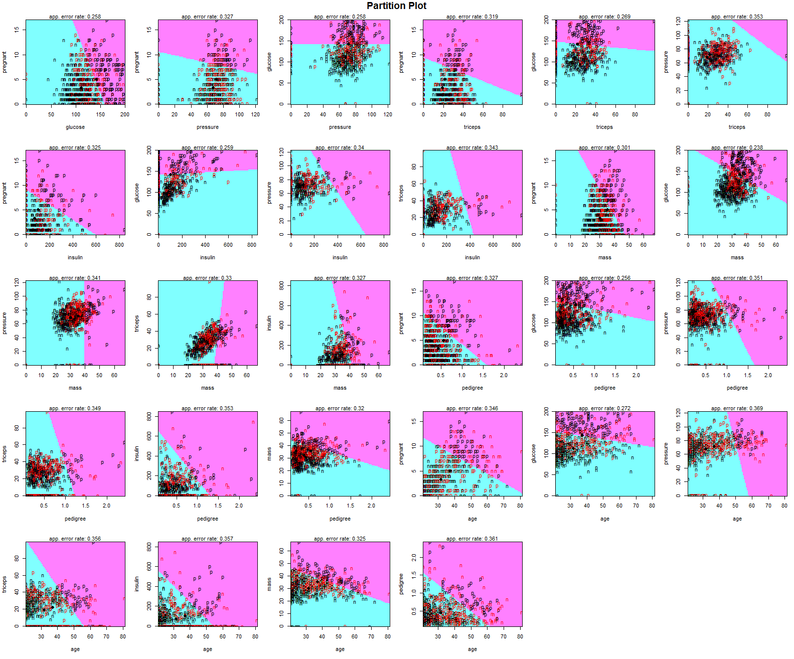

```{r setup, include=FALSE}
library(learnr)
knitr::opts_chunk$set(echo = FALSE)
```

## Preliminary to the lab

[Here](https://open.spotify.com/track/1dYgBxWZcYQR1AdngWtHGH?si=3049c63b1efe4ae7) is a song to make you in a good mood.

Please import the necessary packages.

    library(MASS)
    library(klaR)
    library(ggplot2)
    library(GGally)
    library(mlbench)
    library(ggord)

To install `ggord`, please run the following command.

    # Enable the r-universe repo
    options(repos = c(
        fawda123 = 'https://fawda123.r-universe.dev',
        CRAN = 'https://cloud.r-project.org'))

    # Install ggord
    install.packages('ggord')

```{r,warning=FALSE,message=FALSE,error=FALSE}
library(MASS)
library(caret)
library(ggplot2)
library(ISLR)
```

## Fisher Discriminant Analysis (Linear Discriminant Analysis)

Fisher Discriminant Analysis aka Linear Discriminant Analysis is used in Statistic, pattern recognition and Machine Learning. In this technique, the main idea is to find a linear function formed as a linear combination of the existing variables in the data so that it characterizes or separates at least two groups in the data. In contrast to other classification techniques like NN or Random Forest, this approaches provides more interpretable model.

In the case of two groups, $\pi_1$ and $\pi_2$, Fisher developed an idea to transform the multivariate observations $x$ to univariate observations $y$ such that the $y's$ derived from populations $\pi_1$ and $\pi_2$ as much as possible. Fisher suggested taking linear combinations of $x$ to create the $y's$ because they are simple functions of $x$ and easily handled mathematically.

This function converts the $\pi_1$ and$\pi_2$ multivariate populations into univariate populations such that the corresponding univariate population means are separated as much as possible relative to the population variance.

For a given new set of observations $x_0$

Allocate $x_0$ to $\pi_1$ if

$y_0=\left(\bar{x}_1-\bar{x}_2\right)^{\prime} S_{\{\text {pooled }\}}{ }^{-1} x_0 \geq \hat{m}=\frac{1}{2}\left(\bar{x}_1-\bar{x}_2\right)^{\prime} S_{\{\text {pooled }\}}{ }^{-1}\left(\bar{x}_1+\bar{x}_2\right)$

or

Allocate $x_0$ to $\pi_2$ otherwise.

The equation can be also represented as follows.

$y_0-\hat{m} \geq 0$

There are several commands to conduct LDA in R. Among them, we use `lda()` command from **MASS** function.

**Example**

We will consider `PimaIndiansDiabetes` dataset from `mlbench` package. This dataset is a well-known and frequently used for classification examples.

```{r}
library(mlbench)
data("PimaIndiansDiabetes")
head(PimaIndiansDiabetes)
```

The data has 768 observations on 9 variables, whose descriptions are given below.

-   pregnant: Number of times pregnant

-   glucose: Plasma glucose concentration (glucose tolerance test)

-   pressure: Diastolic blood pressure (mm Hg)

-   triceps: Triceps skin fold thickness (mm)

-   insulin: 2-Hour serum insulin (mu U/ml)

-   mass: Body mass index (weight in kg/(height in m)\^2)

-   pedigree: Diabetes pedigree function

-   age: Age (years)

-   diabetes: Class variable (test for diabetes)

Our objective is to find a function that separates the patients based on their medical values so that we can classify them as a diabetes or not.

Prior to developing the model, we can conduct a couple of exploratory analysis so that we have an idea about the data.

    str(PimaIndiansDiabetes)

```{r}
str(PimaIndiansDiabetes)
```

It is seen that we do not have any class problem, so we can proceed.

    summary(PimaIndiansDiabetes)

```{r}
summary(PimaIndiansDiabetes)
```

500 patients do not have diabetes problem while 268 of them have. The `summary` command also shows that the data does not have any missing observations.

It is also possible to calculate the summary statistics of these variables by diabetes situation using `dplyr` commands. For example,

```{r}
library(dplyr)
PimaIndiansDiabetes%>%group_by(diabetes)%>%summarize(average_glucose = mean(glucose), sd_glucose = sd(glucose))
```

The average glucose concentration for patients without diabetes is $109.98 \pm 26.14$. The average glucose concentration for patients with diabetes is $141.26 \pm 31.94$. The average glucose is higher for the one with diabetes, as we expected.

After the numerical descriptive analysis, we can use the visual tools. Note that LDA performs well when the $x$ variables, i.e. features, has the normal distribution.

    GGally::ggpairs(PimaIndiansDiabetes)

```{r,warning=FALSE,message=FALSE}
GGally::ggpairs(PimaIndiansDiabetes)
```

The `ggpairs` function provides multiple plots, which makes the comparison between groups easier, and correlation value among the numerical variables. The plot shows that the almost all variables in the data does not follow the normality. However, we can still try and see what the default linear discriminant function does.

The plots above can be also drawn for each group separately as well as calculating the correlation for each case. In other words, for example, we can draw density plots for diabetes and non-diabetes on the same frame.

    GGally::ggpairs(PimaIndiansDiabetes,  aes(color = diabetes,  # Color by group (cat. variable)
    alpha = 0.5)) 

```{r,warning=FALSE,message=FALSE}
GGally::ggpairs(PimaIndiansDiabetes,  aes(color = diabetes,  # Color by group (cat. variable)
alpha = 0.5)) 
```

As given above, we have two groups $G=2$ and we want to separate the patients by diabetes using 8 variables (pregnant,...,age) $p=8$. This means that the maximum number of useful discriminant functions that can separate the patients by diabetes is the minimum of $G-1$ and $p$. Thus, we can find at most **1** useful function to separate the patients by diabetes, using 8 medical variables.

Since this is a kind of classification problem and we have several alternatives to solve it, we need to evaluate the performance of the model in practice. That is we should divide the data into two parts, train and test. We will use train data to find the function and test data to evaluate the model performance.

There are many ways to divide the data. We use the simplest one, `sample` function. We will use 80% of the data as train and 20% of the data as test.

    #make this example reproducible
    set.seed(1)

    #Use 80% of dataset as training set and remaining 30% as testing set
    sample <- sample(c(TRUE, FALSE), nrow(PimaIndiansDiabetes), replace=TRUE, prob=c(0.8,0.2))
    train <- PimaIndiansDiabetes[sample, ]
    test <- PimaIndiansDiabetes[!sample, ] 

```{r}
#make this example reproducible
set.seed(1)

#Use 80% of dataset as training set and remaining 30% as testing set
sample <- sample(c(TRUE, FALSE), nrow(PimaIndiansDiabetes), replace=TRUE, prob=c(0.8,0.2))
train <- PimaIndiansDiabetes[sample, ]
test <- PimaIndiansDiabetes[!sample, ] 
```

Now, we will carry out the analysis using `lda` command from **MASS** package.

    lda(x, ...)

    ## S3 method for class 'formula'
    lda(formula, data, ..., subset, na.action)

In this syntax, the structure of the formula is `categorical response ~ predictor1+..predictorp`. If we include all predictors, we can use `.` (dot) punctuation.

    library(MASS)
    model <- lda(diabetes~.,data = train)

```{r}
library(MASS)
model <- lda(diabetes~.,data = train)
```

To get the values of the loadings of the discriminant functions for the wine data, we can type:

    model

```{r}
model
```

The LDA output indicates that $\pi_{neg} = 0.646$ and $\pi_{pos} = 0.354$; in other words, 64.6% of the training observations correspond to patients without diabetes. It also provides the group means; these are the average of each predictor within each class, and are used by LDA as estimates of $\mu_k$.

The coefficients of the linear discriminants provides the linear combination of the variables. The model is $0.111*pregnant......+0.006*age$. If this is model is large, then LDA classifier will predict the patient is not diabetes, and if it is small, then the classifier will predict the patient is diabetes.

The `plot` function returns the plot of the linear discriminants obtained from the equation given above.

    plot(model)

```{r}
plot(model)
```

You can get the prediction of the model constructed above using `predict` command. It returns three elements.

    model.values <- predict(model)
    names(model.values)

```{r}
model.values <- predict(model)
names(model.values)
```

The first element, class, contains LDA's predictions about the patients.

The second element, posterior, is a matrix whose kth column contains the posterior probability that the corresponding observation belongs to the kth class.

Finally, x contains the linear discriminants, described earlier.

Before evaluating the model performance using confusion matrix, we can illustrate the separation among the groups visually. It can done by using scatter plot, partition plot, and biplot.

In this example, unfortunately, since we have only one linear discriminant function, we cannot draw a scatter plot. For multiple class example, you can visit [this page](https://www.r-bloggers.com/2021/05/linear-discriminant-analysis-in-r/).

We can use partiton plot It provides the classification of each and every combination in the training dataset.

    library(klaR)
    partimat(diabetes~.,data=train,method="lda") 




In the last step, we will evaluate the performance of the model using confusion matrix.

**Train performance**

    train_predict<- predict(model,train)$class
    table_train <- table(Predicted =train_predict, Actual = train$diabetes)
    table_train

```{r}
train_predict<- predict(model,train)$class
table_train <- table(Predicted =train_predict, Actual = train$diabetes)
table_train
```

Now, calculate the accuracy of the model.

    sum(diag(table_train))/sum(table_train)

```{r}
sum(diag(table_train))/sum(table_train)
```

The model correctly classifies the patients with 0.78 probability for the training data.

The classification error rate (misclassification rate) for training data is $1-0.78 = 0.32$

**Test Performance**

If we are interested in the test performance of the model.

```{r}
test_predict<- predict(model,test)$class
table_test <- table(Predicted =test_predict, Actual = test$diabetes)
table_test
```

Now, calculate the accuracy of the model.

    sum(diag(table_test))/sum(table_test)

    [1] 0.7527211

The model correctly classifies the patients with 0.75 probability for the test data.

The classification error rate (misclassification rate) for test data is $1-0.8 = 0.25$

We use these train and test data for comparing the multiple models for the same problem. However, for your term project, you have only one model to examine, so you can use whole dataset for the discriminant analysis.

**References**

-   <https://www.r-bloggers.com/2021/05/linear-discriminant-analysis-in-r/>

-   Gareth James, Daniela Witten, Trevor Hastie, Robert Tibshirani. (2013). An introduction to statistical learning : with applications in R. New York :Springer,
